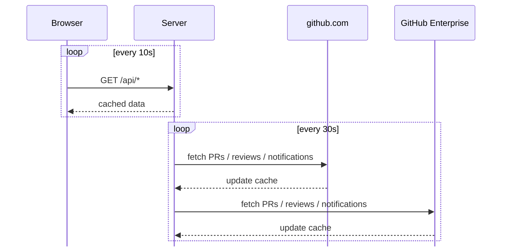

# GitHub Dashboard

A keyboard-driven dashboard for staying on top of your GitHub pull requests, reviews, and notifications. Supports multiple GitHub instances (github.com + GitHub Enterprise) side by side.

Act on a PR from your keyboard without leaving the dashboard:

- Toggle draft state
- Rerun failed CI jobs
- Change PR titles
- Approve and close PRs
- ...and more!


## Download

Pre-built macOS app is available from the [Releases page](https://github.com/AntonNiklasson/github-dashboard/releases).

## Keyboard shortcuts

| Key | Action |
|---|---|
| `j` / `k` or `↓` / `↑` | Move down / up |
| `h` / `l` or `←` / `→` | Move between columns |
| `Tab` | Switch instance tab |
| `Enter` / `Space` | Open detail panel |
| `o` | Open PR in browser |
| `r` | Open repo |
| `.` | Action menu |
| `y` | Copy menu |
| `d` | Toggle draft |
| `m` | Toggle auto-merge |
| `a` | Approve PR |
| `c` | Close PR |
| `e` | Dismiss review / notification |
| `,` | Settings |
| `?` | Show shortcut help |

### Inside the detail panel

| Key | Action |
|---|---|
| `h` / `l` or `←` / `→` | Switch tab (Overview / Comments / Files) |
| `j` / `k` or `↓` / `↑` | Scroll |
| `Esc` | Close panel |

## Setup

```bash
pnpm install
cp config.yaml.example config.yaml
# edit config.yaml with your token(s)
pnpm dev
```

The server starts on port 7100 by default (configurable in `config.yaml`). Alternatively, skip editing the file and configure everything through the onboarding UI in the browser.

## Configuration

All configuration lives in `config.yaml`:

```yaml
port: 7100

github:
  token: ghp_...

enterprise:
  label: GHE
  baseUrl: https://ghe.example.com/api/v3
  token: ghp_...
```

- **github** — github.com personal access token (needs `repo`, `notifications` scopes)
- **enterprise** — optional GitHub Enterprise instance with its own token and base URL
- **port** — server port (default 7100)

Tokens can also be updated from the settings modal in the UI.

## Notifications

The Notifications column is intentionally narrower than GitHub's own inbox — it drops items that are either already represented elsewhere in the dashboard or are pure noise:

| Reason | Subject | Why it's dropped |
|---|---|---|
| `review_requested` | any | Shown in the Reviews column |
| `ci_activity` | any | Visible on the PR itself |
| `author` | `PullRequest` | Your own PR, shown in My work |
| `state_change` | `PullRequest` | Your own PR, shown in My work / Reviews |
| `subscribed` | any | Auto-subscription noise |

Everything else (mentions, team mentions, assignments, comments on threads you participate in, security alerts, …) flows through unchanged.

## Architecture



The server keeps a disk-backed cache of the last sync and serves the browser from that, so the UI stays snappy and the API is hit at a predictable cadence regardless of how many tabs are open.
