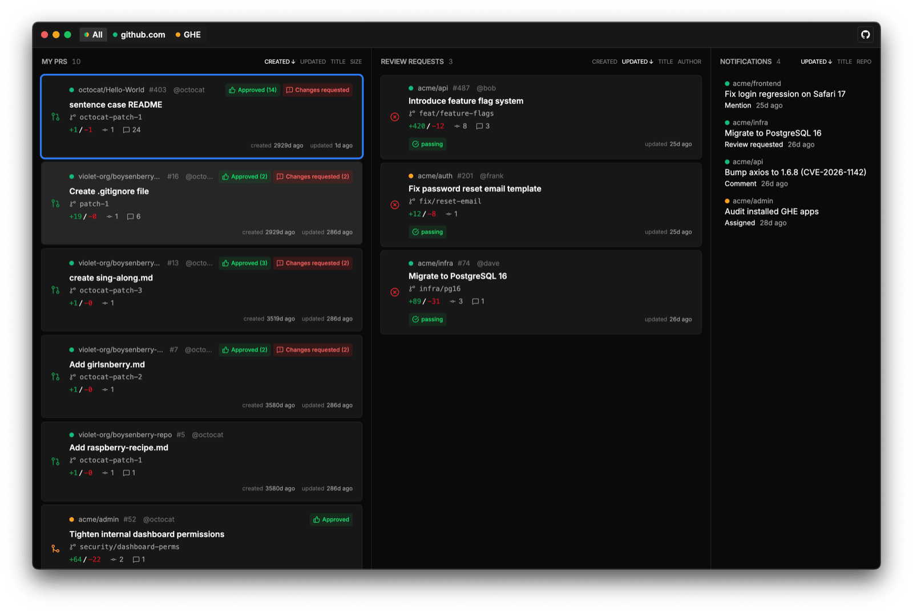
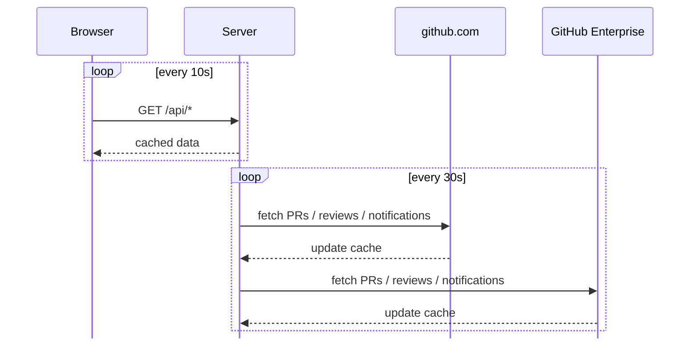

# GitHub Dashboard

A keyboard-driven dashboard for staying on top of your GitHub pull requests, reviews, and notifications. Supports multiple GitHub instances (github.com + GitHub Enterprise) side by side.

Act on a PR from your keyboard without leaving the dashboard:

- Toggle draft state
- Rerun failed CI jobs
- Change PR titles
- Approve and close PRs
- ...and more!



## Download

Pre-built macOS app is available from the [Releases page](https://github.com/AntonNiklasson/github-dashboard/releases).

## Keyboard shortcuts

| Key | Action |
|---|---|
| `j` / `k` or `↓` / `↑` | Move down / up |
| `h` / `l` or `←` / `→` | Move between columns |
| `Tab` | Switch instance tab |
| `Enter` / `Space` | Open detail panel |
| `o` | Open PR in browser |
| `r` | Open repo |
| `.` | Action menu |
| `y` | Copy menu |
| `d` | Toggle draft |
| `m` | Toggle auto-merge |
| `a` | Approve PR |
| `c` | Close PR |
| `e` | Dismiss review / notification |
| `?` | Show shortcut help |

### Inside the detail panel

| Key | Action |
|---|---|
| `h` / `l` or `←` / `→` | Switch tab (Overview / Comments / Files) |
| `j` / `k` or `↓` / `↑` | Scroll |
| `Esc` | Close panel |

## Configuration

The dashboard reads `~/.config/github-dashboard/config.yml` (honors `$XDG_CONFIG_HOME` if set). On first launch the Welcome screen offers a "Set it up for me!" button that scaffolds the file and opens it in your default editor.

The config file:

```yaml
theme: system
instances: # one or more
  - domain: github.com
    token: ghp_...
  - domain: ghe.example.com
    label: GHE
    token: ghp_...
```

- **instances** — at least one GitHub instance. List as many as you like (github.com and any number of GHES installs).
  - **domain** — `github.com` or your GHES host. Accepts a bare host (`ghe.example.com`), a URL (`https://ghe.example.com`), or the full API base — `https://` and `/api/v3` are filled in automatically. For github.com, the API base is set to `https://api.github.com`.
  - **token** — personal access token (needs `repo`, `notifications` scopes). For github.com, [create one with the scopes pre-selected](https://github.com/settings/tokens/new?scopes=repo,notifications&description=GitHub%20Dashboard).
  - **label** — optional display name in the tab strip. Defaults to the domain.
- **theme** — `system` (default), `light`, or `dark`

## Notifications

The Notifications column is intentionally narrower than GitHub's own inbox — it drops items that are either already represented elsewhere in the dashboard or are pure noise:

| Reason | Subject | Why it's dropped |
|---|---|---|
| `review_requested` | any | Shown in the Reviews column |
| `ci_activity` | any | Visible on the PR itself |
| `author` | `PullRequest` | Your own PR, shown in My work |
| `state_change` | `PullRequest` | Your own PR, shown in My work / Reviews |
| `subscribed` | any | Auto-subscription noise |

Everything else (mentions, team mentions, assignments, comments on threads you participate in, security alerts, …) flows through unchanged.

## Architecture


```mermaid
%%{init: {'sequence': {'mirrorActors': false}}}%%
sequenceDiagram
    participant Browser
    participant Server
    participant GH as github.com
    participant GHE as GitHub Enterprise

    loop every 10s
        Browser->>Server: GET /api/*
        Server-->>Browser: cached data
    end

    loop every 30s
        Server->>GH: fetch PRs / reviews / notifications
        GH-->>Server: update cache
        Server->>GHE: fetch PRs / reviews / notifications
        GHE-->>Server: update cache
    end
```

The server keeps a disk-backed cache of the last sync and serves the browser from that, so the UI stays snappy and the API is hit at a predictable cadence regardless of how many tabs are open.

### Standalone sync CLI

The separate CLI uses `packages/sync`'s public runtime; the existing API server has not yet been migrated. Build with `pnpm build`, then run:

```sh
pnpm --silent cli once --instance github-com --kind prs --json
pnpm --silent cli list --json    # offline, reads the persisted SQLite cache
pnpm cli watch --interval 25    # log/JSON polling for scripts
pnpm cli                       # interactive TUI, polls every 25 seconds
pnpm dev:cli                   # TUI with automatic restart on source changes
```

`pnpm dev:cli` runs directly from TypeScript (no build needed) and watches imported CLI and sync sources. Restarts preserve the disk cache, but reset UI selection and discard unsent comment drafts. `q` stops the TUI; Ctrl+C at the watcher prompt exits watch mode.

`tui` (Ink; Node 22+) shows cached items immediately, with instance tabs at the top and list/detail panes below, then refreshes. Use Tab/Shift-Tab or [ / ] for instances, 1–3 for views, ↑/↓ or j/k for items, / to search, o to open an item in the browser, y to copy its URL, r to refresh, ? for help, and q to quit. Enter on a PR focuses its live diff: [ / ] switches files, j/k navigates lines, V starts/ends a visual line selection, and c (or Enter) drafts a review comment on the selected line(s). Enter adds a newline to the draft; Ctrl+D previews the target; y explicitly posts, n returns to editing, Esc cancels or returns to the list. Binary/oversized files without a text patch cannot be commented on. GitHub may reject a comment if the PR head changes after the diff loads. Notifications remain read-only. Opening a PR fetches its diff on demand (requires network/auth); cached lists remain offline. Confirming a comment posts it immediately to GitHub, not as a pending review. SIGINT/SIGTERM drain active work. `--instance` and `--kind` (initial TUI view: `prs`, `reviews`, `notifications`) work on all commands; `--json` works on non-TUI commands. Omit instance/kind for all configured targets. Config is read from `$XDG_CONFIG_HOME/github-dashboard/config.yml` (default `~/.config/github-dashboard/config.yml`). Cache is at `$XDG_CACHE_HOME/github-dashboard/cache.sqlite` (default `~/.cache/github-dashboard/cache.sqlite`). `list` never reads config or accesses the network. JSON writes one object per cycle to stdout, with `cycle: null` for offline/initial watch output. Failures and skips retain old snapshots. Exit codes: 0 success (including rate-budget skips and clean watch shutdown), 1 invalid arguments/config or structural error, 2 one-shot fetch/auth failures. Diagnostics go to stderr. The disposable sync cache upgrades by rebuilding on schema-version mismatch.

## Developing locally

```bash
pnpm install
pnpm dev       # full target: server + web + Electron
pnpm dev:web   # browser-only, no Electron window
```
